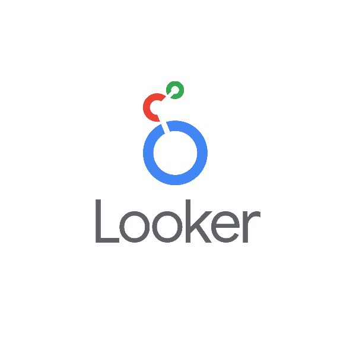

  

## 👋 About Me

Data Engineer / BI Engineer with experience in building ETL pipelines, analytics solutions, dashboards, and data quality workflows. I work on end-to-end data systems, from ingestion and transformation to reporting and decision support.

📍 Based in France  
🎓 Master's in Big Data & AI  
💼 Looking for a Full time job from September 2026 

---

## 📊 Core Expertise

  ETL/ELT • Data Pipelines • Data Modeling • Data Quality • Business Intelligence • Dashboarding • Analytics • Machine Learning

---

## 🛠️ Tech Stack

### Data Engineering

  
  
  
  
  
  

### Databases & Storage

  
  
  
  

### BI & Visualization

  
  
  
  

### ML / AI

  
  
  

### Tools

  
  
  

---

## 🚀 Featured Projects

### 🔹 Distributed ETL Pipeline for Air Traffic Data
Built a real-time distributed data pipeline using Apache NiFi, Kafka, Spark, PostgreSQL and Power BI.  
This project covers ingestion, streaming transformation, structured storage, and dashboarding for air traffic analytics.

**Highlights**
- Real-time ingestion from OpenAIP API
- Streaming processing with Spark
- Structured storage in PostgreSQL
- Analytical dashboard in Power BI

**Tech**
`NiFi` `Kafka` `Spark` `PostgreSQL` `Power BI` `Docker`

---

### 🔹 Trading Decision System
Designed an end-to-end trading decision platform for GBP/USD using Machine Learning, Reinforcement Learning, FastAPI and Streamlit.  
The project includes feature engineering, model training, backtesting, model serving, and Dockerized deployment.

**Highlights**
- Supervised ML + PPO reinforcement learning
- FastAPI backend for model serving
- Streamlit interface for decision visualization
- End-to-end deployable architecture

**Tech**
`Python` `FastAPI` `Streamlit` `Scikit-learn` `PPO` `Docker`

---

### 🔹 Big Data Pipeline for Books Analytics
Developed a complete data pipeline from CSV ingestion to MongoDB, transformation, analytics, REST API, dashboarding, and predictive modeling.  
This project demonstrates data cleaning, statistical analysis, visualization, and ML integration in a single architecture.

**Highlights**
- Data ingestion and transformation workflow
- MongoDB-based storage
- FastAPI endpoints for analytics and prediction
- Streamlit dashboard for interactive exploration

**Tech**
`Python` `MongoDB` `FastAPI` `Streamlit` `Scikit-learn` `Docker`

---

### 🔹 NLP Names & Surnames Analysis
Built an NLP pipeline to normalize, group, summarize, and explore surname and firstname variants using phonetic and semantic similarity.  
The project includes evaluation, summarization, and an interactive Streamlit interface.

**Highlights**
- Variant grouping with Soundex and semantic similarity
- Automatic summarization pipeline
- Evaluation with ROUGE
- Interactive exploration app

**Tech**
`Python` `Streamlit` `spaCy` `Soundex` `TextRank` `Transformers`

---

### 🔹 Kedro Data Pipeline Project *(in progress)*
Currently building a structured data pipeline project with Kedro to improve modularity, reproducibility, and pipeline organization.  
This project focuses on production-style workflow design, reusable nodes, clean project structure, and maintainable data engineering practices.

**Focus**
- Modular pipeline design
- Reproducible workflows
- Clean architecture for analytics and ML pipelines

**Tech**
`Kedro` `Python` `ETL` `Data Pipelines`

---

## 💼 Experience Snapshot

I have worked on data repositories, multi-source consolidation, ETL pipelines, data quality controls, dashboarding, reporting migration, and reporting automation with tools such as BigQuery, GCP, Google Sheets, AppScript, SQL, Looker Studio, Power BI, Airflow, Spark and Kafka.

---

## 🏆 Certifications

- Google Data Analytics
- Google Business Intelligence
- Databricks Lakehouse Fundamentals :contentReference

---

## 🔗 Connect with Me

  
  &nbsp;&nbsp;
  

---

  

